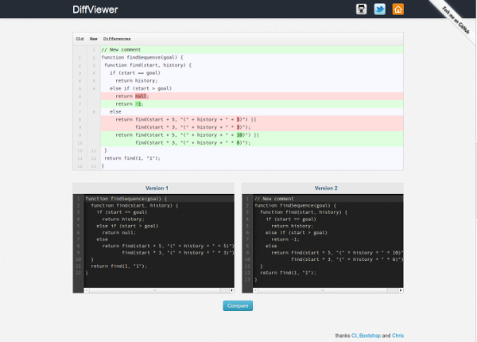

## DiffViewer : Online Diff Tool

DiffViewer is an online tool which allows you to quickly see the differences between two pieces of text. Actually, it is a simple website using [CodeIgniter](http://ellislab.com/codeigniter), [Twitter Bootstrap](http://twitter.github.io/bootstrap/) and [CodeMirror](http://codemirror.net/) to show how easy it is to use the [php-diff](https://github.com/chrisboulton/php-diff) lib.

## Screenshot

## License

This tool is released under the [MIT license](http://en.wikipedia.org/wiki/MIT_License).
